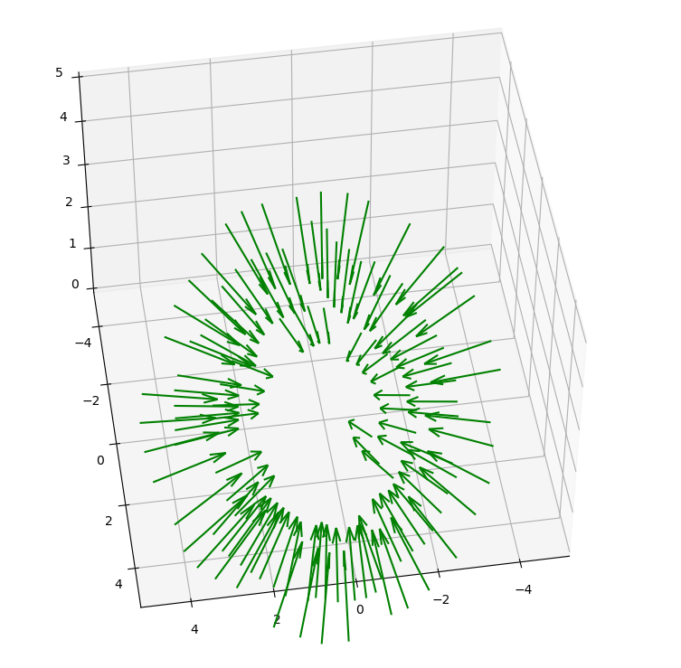

# 相机参数生成及可视化脚本

使用colmap生成相机参数。colmap调用部分使用 [LLFF](https://github.com/Fyusion/LLFF) 的部分代码。
## 运行说明
1. 在系统中安装好colmap3.6以上版本并配置好环境变量。
2. 在python环境下，使用```python run.py --scene ./vasedeck ```即可生成vasedeck中images文件夹下照片的相机参数，并对所有照片对应相机的位置和方向可视化。如果目录下已经存在相机参数，则只做可视化。
3. 输出（IDE为PyCharm，可视化结果可交互）
   
   
## 备注
1. 示例实验使用的数据集从[这里](https://drive.google.com/drive/folders/128yBriW1IG_3NJ5Rp7APSTZsJqdJdfc1) 下载(nerf_real_360.zip里面的vasedeck)。也可以使用摄影设备拍摄自己的数据集。
2. 根据数据集不同，colmap不一定能生成全部照片的相机外参，或根本无法生成。本程序会输出无法生成外参的照片名，并自动给中止程序。
3. 一个奇怪的问题：配置好colmap环境变量后，在Anaconda的baseu环境下，在PyCharm里运行找不到它。切换到Anaconda里其它环境就好了。


